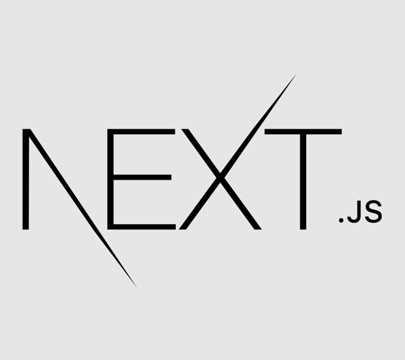
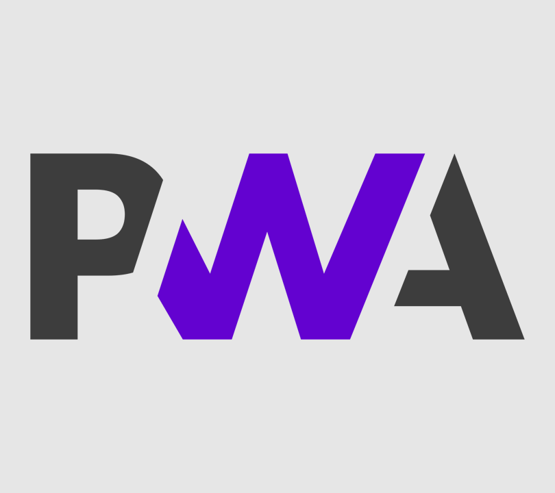

# PWA Template

A template for Next.js with PWA support and i18n.



<!-- toc -->

- [Libraries](#libraries)
- [Getting started](#getting-started)
- [Atomic design](#atomic-design)
- [Behavior Driven Development](#behavior-driven-development)
- [Test Driven Development](#test-driven-development)
- [Commitlint](#commitlint)
- [Commands](#commands)
- [Skipping linters](#skipping-linters)

<!-- tocstop -->

## Libraries

- [Storybook](https://storybook.js.org/)
- [Cypress](https://cypress.io/)
- [Jest](https://jestjs.io/)
- [Commitlint](https://commitlint.js.org/)
- [Stylelint](https://stylelint.io/)
- [XO](https://github.com/xojs/xo)
- [Prettier](https://prettier.io/)

Additional libraries:

- [MUI](https://mui.com/)
- [i18next](https://www.i18next.com/) ([next-i18next](https://github.com/isaachinman/next-i18next))

## Getting started

**Run the development server:**

```bash
yarn dev
```

**Run storybook:**

```shell
yarn storybook
```

## Atomic design

We use atomic design. You can read more about our decision in the
[documentation](./docs/ATOMIC_DESIGN.md).

## Behavior Driven Development

We use behavior tests. You can read more about our decision in the
[documentation](./docs/BEHAVIOR_DRIVEN_DEVELOPMENT.md).

## Test Driven Development

We use jest to write unit tests. Please look at the Documentation for [Jest](https://jestjs.io/)
and [testing-library](https://testing-library.com/docs/react-testing-library/intro/).

## Commitlint

We use commitlint to ensure conventional commit messages. You can read more about our decision in
the [documentation](./docs/COMMITS.md).

## Commands

**Run the development server:**

```bash
yarn dev
```

**Build:**

```shell
yarn build
```

**Run storybook:**

```shell
yarn storybook
```

**Build storybook:**

```shell
yarn storybook:build
```

**Run cypress tests:**

```shell
npm run cypress # local without server
# yarn cypress:run # headless
# yarn test:cypress # with server
```

**Run unit tests:**

```shell
yarn jest
# yarn jest:watch # watch
# yarn test:jest # same as "yarn jest"
```

**Run all tests:**

```shell
yarn test
```

**Run stylelint**

```shell
yarn stylelint
```

**Run xo**

```shell
yarn xo
```

**Run all linters**

```shell
yarn lint
```

## Skipping linters

If you need to skip a linter you can add the `--no-verify` flag.

> Warning! We strongly advise against skipping linters.

```shell
# Skipping pre-commit hooks
git commit README.md -m "this is a dirty commit" --no-verify
```
